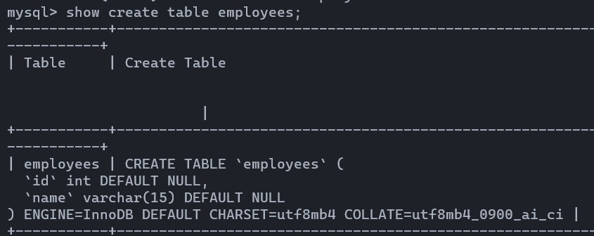
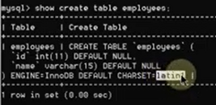
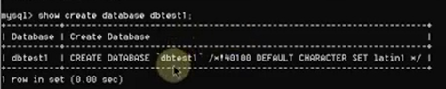
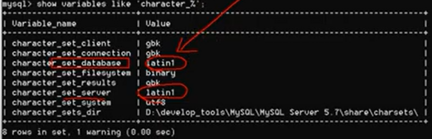
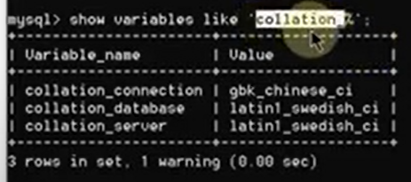
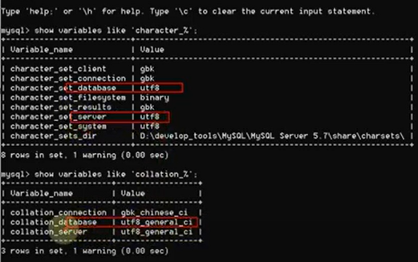

# MySQL 数据库 初级篇 Windows 第二章 安装和基本概念

## 6 卸载

- 文件位置
	- MySQL:  C:\Program Files\MySQL\MySQL Server 8.0
	- data: C:\ProgramData\MySQL\MySQL Server 8.0
		- 表
		- 配置文件
	- 环境变量
	- Service
		- 计算机管理

## 7 安装

- 启动 | 关闭 服务
	- services.msc
	- net start MySQL80
	- net stop MySQL80
- 登录
	- mysql -u root -pdbadmin -h localhost -P 3306|其他版本的端口号
	- mysql -u root -P 3306|其他版本的端口号 -p
- 版本
	- select version();

## 9 字符集设置

- show databases;
	- information_schema
		- 系统信息：数据库名称，表名称，存储权限，等
	- mysql
		- 运行时需要的系统信息: 数据库文件夹，字符集，等
	- performance_schema
		- 监控形成指标
	- sys
		- 性能指标
- 操作
	- create database dbtest1;
	- use dbtest1;
	- create table employees (id int, name varchar(15));
	- show tables;
	- insert into employess values (1, '张三');
	- select ...
- char 中有中文
	- 8.0
		- ok

			
		- 
	- 5.7
		- error
		- show create table employees;

			

			- 设置的字符集

				
				

			- 比较规则

				

		-  更改设置
			- my.init

				

				

			- restart mysql
			 
				

			- 造库和表的时候时用的 latin，所以现在还是不能插入中文
				- 更改库和表的设置
				- 或者重新造库和表