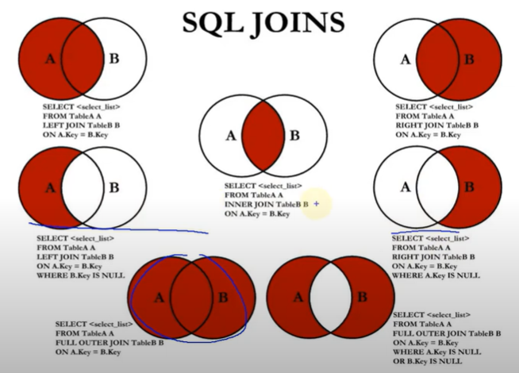
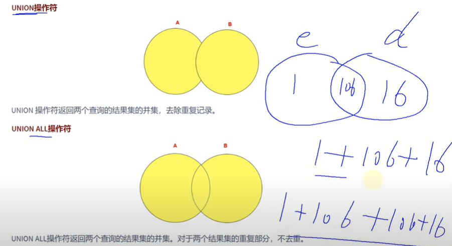
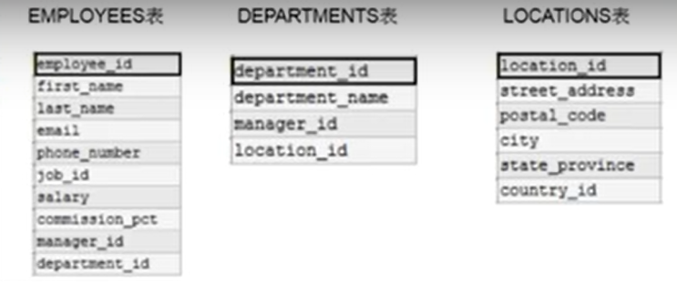
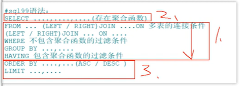
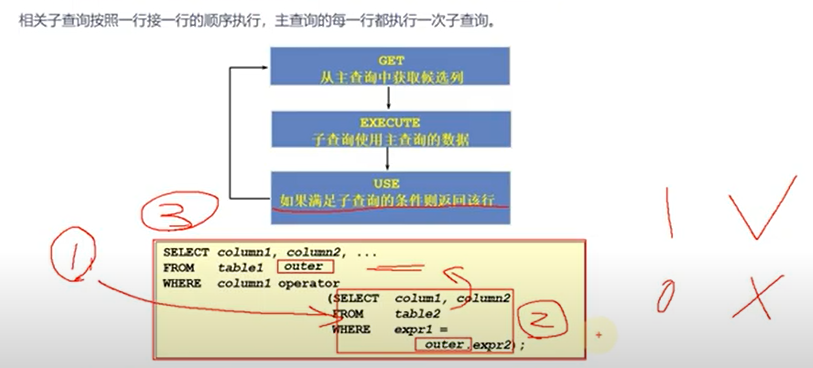

# SQL (structured query language) 语句

## SQL 分类

- DDL: Data Definitian Languages 数据定义语言
	- 创建数据库对象
	- CREATE \ ALTER \ DROP \ RENAME \ TRUNCATE
- DML: Data Manipulation Language 数据操作 语言
	- 针对 record 的操作行为
	- INSERT \ DELETE \ UPDATE \ SELECT
- DCL: Data Control Language 数据控制语言
	- 控制操作
	- COMMIT \ ROLLBACK \ SAVEPOINT \ GRANT \ REVOKE

## SQL 规则与规范

- 规则
	- 可写在一行或多行
	- 每条命令必须以 ; 或 \g, \G (输出以行的形式) 结束
	- 字符串、日期时间类型的变量要用 ''
	- 列的别名使用 ""
- 规范
	- 数据库名、表名、表别名、字段名、字段别名等都小写
	- SQL 关键字、函数名、绑定变量等都大写
- 注释
	- 单行 #
	- 单行 --空格
	- 多行 /* */
- 导入现有的数据表、表的数据
	- 方式1: source 文件的全路径名
		- source ./atguigudb.sql
	- 方式2: GUI

## 查询语句
### SELECT 语句

- 最基本的语句
	- SELECT 字段， 字段 FROM 字段所在表的表名
	- SELECT 1 + 1, 3 * 2 [FROM DUAL
];
		- DUAL 伪表
	- SELECT * FROM ...
-  列的别名
	- [AS]
	- [""]
- 去重
	- SELECT DISTINCT ...
- 空值参与运算
	- 空值: NULL
	- NULL 不等同于 0, ' ', 'null'
	- 参与运算
		- 结果为 NULL
		- 函数 IFNULL(commission_pct, 0)
- 着重号 ``
	- 用着重号转义关键字
- 查询常数
	- SELECT '尚硅谷', 123, emplyee_id, last_name FROM employees;
- 显示表结构 (详细信息)
	- DESCRIBE employees;
	- DESC employees;
- 过滤数据
	- WHERE
	 - MySQL 在 Windows 下不区分大小写
	- 紧挨着 FROM
- 运算符
	- 算数运算符:
		- +: 加码，没有连接作用
			- SELECT 100 + '1' -> 101
			- SELECT 100 + 'a' -> 100
			- SELECT 100 + null -> 100
		- -
		- *
		- / div
			- SELECT 100 div 0 -> NULL
		- % mod
	- 比较运算符
		- =
			- SELECT 1 = 'a', 0 = 'a' FROM DUAL;
			- 只要有 NULL, 结果就是 NULL
			- SELECT last_name, salary FROM employees WHERE comission_pct = NULL; 空
		- <=> 安全等于
			- 可以对 NULL 进行判断
			- SELECT 1 <=> 2, NULL <=> NULL; 0, 1
			- SELECT last_name, salary FROM employees WHERE comission_pct <=> NULL; 可查到
		- <> !=
		- <
		- <=
		- \>
		- \>=
		- IS NULL
		- ISNULL()
		- IS NOTNULL
		- LEAST('g', 'b', 't', 'm'): 最小 'b'
		- GREATEST('g', 'b', 't', 'm'): 最大 't'
		- BETWEEN ...(下界) AND ...(上界) 包含边界
		- IN (set)
			- SELECT * FROM employees WHERE department_id IN (10, 20, 30);
		- NOT IN
		- LIKE 模糊查询
			- %: 不确定个数的字符
				- WHERE last_name LIKE '%a%';
			- _: 一个不确定的字符
				- WHERE last_name LIKE '__a%';
			- \: 转义符
				- '_\_a%'
			- ESCAPE: 定义转义符
				- '_$_a%' ESCAPE '$'
		- REGEXP 正则
			- WHERE 'shkstart' REGEXP '^s'
		- RLIKE
	- 逻辑运算符
		- NOT !
		- AND &&
		- OR ||
		- 异或
			- A XOR B (满足 A 且不满足 B，或者, 不满足 A 且满足 B)
		- AND 优先级高于 OR
	- 位运算符
		- & 按位与
			- SELECT 12 & 5
		- | 按位或
			- SELECT 12 | 5
		- ^ 按位异或
		- ~ 按位取反
		- \>\> 除以 2
			- SELECT 4 \>\> 1
		- << 乘以 2
			- SELECT 4 << 1
- 排序与分页
	- 排序
		- ORDER BY .列或列的别名. ASC (ascend) | DESC (descend), ... , ...
			- WHERE 里不能用别名
				- SQL 的执行并不是从上往下，而是按照 FROM, WHERE, SELECT ORDERY BY 的顺序执行，ORDER BY 在 SELECT 后面，所有已经给列起了别名，可以被引用，但是 WHERE 在 SELECT 前边，别名还没有定义
	- 分页
		- LIMIT 0(偏移量),20(条目数)
			- pgsql 语法错误
			- LIMIT (pageNo - 1) * pageSize,pageSize
		- 声明顺序
			- WHERE ... ORDER BY ... LIMIT ...
		- OFFSET (mysql 8.0)
### 多表查询

- 笛卡尔积错误
	- SELECT employee_id, department_name FROM employess, departments
		- 等价于 SELECT employee_id, department_name FROM employees CROSS JOIN departments;
		- 选择了每一个员工和部门的匹配 (员工有 107 人，老大没有部门 id)
- 需要连接条件 ()
	- 从 sql 优化的角度，建议夺标查询时，每个字段前都知名其所在的表
	- 如果起了别名，SELECT 里和 WHERE 里也都要用别名
	- n 个表，至少要 n - 1 个连接条件
	- SELECT emp.employee_id, dept.department_name, emp.department_id FROM employess emp, departments dept WHERE emp.department_id = dept.department_id;
- 多表查询的分类
	- 角度1： 等值连接 vs 非等值连接
		- 工资在某一个范围的员工
			- SELECT e.last_name, e.salary, j.grade_level FROM employess e, job_grades j WHERE e.salary BETWEEN j.lowest_sal AND j.hightst_sal (WHERE e.salary >= j.lowest_sal AND e.salary <= j.hightst_sal);
	- 角度2： 自连接 vs 非自连接
		-	员工姓名及其管理者的 id 和姓名
			- SELECT emp.employees_id, emp.last_name, mgr.employees_id, mgr.last_name FROM employees emp, employees mgr WHERE emp.manager_id = mgr.employee_id;
	- 角度3： 内连接 vs 外连接

		

		- 内连接 (只完全找匹配的)
			- SELECT employee_id, department_name FROM employess, departments
			- SELECT last_name, department_name FROM employees e JOIN departments d ON e.department_id = d.department_id;
		- 外连接
			- 左外连接
				- (SQL92, mysql 不支持) SELECT employee_id, department_name FROM employess, departments(+);
				- (SQL99) SELECT last_name, department_name FROM employees e LEFT JOIN departmentsd on e.department_id = d.department_id;
			- 右外连接
				- RIGHT JOIN
			- 满外连接
				- (SQL99, mysql 不支持)FULL OUTER JOIN
		- UNION
			- UNION VS UNION ALL (尽量用 UINON ALL, 因为 UNION 要去重，所以效率低了)
			
		- 7 种 JOIN 的实现
			- 中图：内连接
				- SELECT employee_id, department_name FROM employees e JOIN departments d ON e.department_id = d.department_id;
			- 左上图: 左外连接
				- SELECT employee_id, department_name FROM employees e LEFT JOIN departments d ON e.department_id = d.department_id;
			- 右上图: 右外连接
				- SELECT employee_id, department_name FROM employees e RIGHT JOIN departments d ON e.department_id = d.department_id;
			- 左中图:
				- SELECT employee_id, department_name FROM employees e LEFT JOIN departments d ON e.department_id = d.department_id WHERE d.department_id IS NULL;
			- 右中图:
				- SELECT employee_id, department_name FROM employees e RIGHT JOIN departments d ON e.department_id = d.department_id WHERE e.department_id IS NULL;
			- 左下图: 满外连接
				- 左上图 UNION ALL 右中图
					- SELECT employee_id, department_name FROM employees e LEFT JOIN departments d ON e.department_id = d.department_id UNION ALL SELECT employee_id, department_name FROM employees e LEFT JOIN departments d ON e.department_id = d.department_id WHERE d.department_id IS NULL;
				- 左种图 UNION ALL 右上图
			- 右下图
				- 左中图 UNION ALL 右中图
					- SELECT employee_id, department_name FROM employees e LEFT JOIN departments d ON e.department_id = d.department_id WHERE d.department_id IS NULL UNION ALL SELECT employee_id, department_name FROM employees e RIGHT JOIN departments d ON e.department_id = d.department_id WHERE e.department_id IS NULL;
	- SQL 99	
		- NATRUAL JOIN
			- 自动查询相同的字段，进行等值连接

			

			- SELECT eimployee_id, last_name, department_name FROM employees e JOIN departments d ON e.department_id = d.department_id AND e.manager_id = d.manager_id;
			- SELECT eimployee_id, last_name, department_name FROM employees e NATUARL JOIN departments d
		- USING
			- SELECT employee_id, last_name, department_name FROM employees e JOIN departments d ON e.department_id = d.department_id;
			- SELECT employee_id, last_name, department_name FROM employees e JOIN departments d USING (department_id);
	- 建议:
		- 写字段时带上表名或表别名
		- 禁止超过三个表的 JOIN

## 函数

- 分类
	- 实现的功能角度
		- 数值函数
		- 字符串函数
		- 日期和时间函数
		- 流程控制函数
		- 加密和解密函数
		- 获取 MySQL 信息函数
		- 聚合函数
		- ...
	- 输入输出角度
		- 内置函数
			- 单行函数
			- 聚合函数（或分组函数）
		- 自定义函数

### 单行函数

- 数值函数
	- 基本函数
		- ABS(x)
		- SIGN(x)
		- PI()
		- CEIL(x), CEILING(x)
		- FLOOR(x)
		- LEAST(e1, e2, e3, ...)
		- GREATEST(e1, e2, e3, ...)
		- MOD(x, y)
		- RAND()
		- RAND(x): x 相同，随机数也相同
		- ROUND(x): 四舍五入出一个整数
		- ROUND(x, y): 保留小数点的 y 位
		- TRUNCATE(x, y): 对 x 值取 y 位
		- SQRT(x)
	- 角度弧度互换
		- RADIANS(x): 角度换弧度
		- DEGRESS(x): 弧度换位角度
	- 三角函数
		- SIN(x)
		- ASIN(x)
		- COS(x)
		- ACOS(x)
		- TAN(x)
		- ATAN(x)
		- ATAN2(m, n)
		- COT(x)
	- 指数对数
		- POW(x)
		- POWER(x)
		- EXP(x)
		- LN(x), LOG(x)
		- LOG10(x)
		- LOG2(x)
	- 进制间转换
		- BIN(x)
		- HEX(x)
		- OCT(x)
		- CONV(x, f1, f2)
- 字符串函数
	- ASCII(s): 只返回第一个字符的码
	- CHAR_LENG(s): 字符长度
	- LENGTH(s): 字节长度
	- CONCAT(s1, s2, ..., sn): 连接
	- CONCAT_WS(x, s1, s2, ..., sn): x 连接符
	- INSERT(str, idx, len, replacestr): 对 x 从 idx (从 1 开始) 用 replacestr 替换 len 位 
	- REPLACE(str, a, b)
	- UPPER(s), UCASE(S)
	- LOWER(s), LCASE(s)
	- LEFT(str, n): 取左边的 n 个字符
	- Right(str, n)
	- LPAD(str, len, pad): 用 pad 从左边补齐, 右对齐效果
	- RPAD(str, len, pad)
	- LTRIM(s)
	- RTRIM(s)
	- TRIM(s)
	- TRIM(s1 FROM s): 去除首位的 s
	- TRIM(LEADING s1 FROM s)
	- TRIM(TRAILING s1 FROM s)
	- REPEAT(str, n)
	- SPACE(n)
	- STRCMP(s1, s2): 比较字符串大小
	- SUBSTR(s, index, len)
	- LOCATE(substr, str)
	- ELT(m, s1, s2, ..., sn): 从 s 中取 m 位
	- FIELD(s, s1, s2, ..., sn): 找到 s 在后面的 s 中首次出现的位置
	- FIND_IN_SET(s1, s2)
	- REVERSE(S)
	- NULLIF(s1, s2): 如果 s1 等于 s2，返回 NULL, 否则返回 s1
- 日期和时间类型
	- 获取日期、时间
		- CURDATE(), CURRENT_DATE()
		- CURTIME(), CURRENT_TIME()
		- NOW() / SYSDATE() / CURRENT_TIMESTAMP() / LOCALTIME() / LOCALTIMESTAMP()
	 - UNIX_TIM
		STAMP()
		- UNIX_TIMESTAMP(date)
		- FROM_UNIXTIME(timestamp)
	- 获取月份、星期、星期数、天数等函数
		- YEAR(date)/MONTH(date)/DAY(date)
		- HOUR(time)/MINUTE(time)/SECOND(time)
		- MOHTHNAME(date)
		- DAYNAME(date)
		- WEEKDAY(date)
		- QUATER(date)
		- WEEK(date), WEEKOFYEAR(date)
		- DAYOFYEAR(date)
		- DAYOFMONTH(date)
		- DAYOFWEEK(date)
	- 日期的操作函数
		- EXTRACT(type FROM date)
	- 时间和秒钟转换的函数
		- TIME_TO_SEC(time)
		- SEC_TO_TIME(seconds)
	- 计算日期和时间的函数
		- DATE_ADD(datetime, INTERVAL expr type)
		- ADDDATE(date, INTERVAL expr type)
		- DATE_SUB(date, INTERVA, expr type), SUBDATE(date, INTERVAL expr type)
		- ADDTIME(time1, time2)
		- SUBTIME(time1, time2)
		- DATEDIFF(date1, date2)
		- TIMEDIFF(time1, time2)
		- FROM_DAYS(N)
		- TO_DAYS(date)
		- LAST_DAY(date)
		- MAKEDATE(year, n)
		- MAKETIME(hour, minute, second)
		- PERIOD_ADD(time, n)
	- 日期的格式化和解析
		- DATE_FORMAT(date, fmt)
		- TIME_FORMAT(time, fmt)
		- GET_FORMAT(date_type, format_type)
		- STR_TO_DATE(str, fmt)
- 流程控制函数
	- IF(value, value1, value2)
	- IFNULL(value1, value2)
	- CASE WHEN 条件1 THEN 结果1 WHEN 条件2 THEN 结果2 ... [ELSE return] END
		- if ... else
	- CASE expr WHEN 常数值1 THEN 值1 WHEN 常数值2 THEN 值2 ... [ELSE 值n] END
		- switch ... case
	- 为什么没有循环语句？SQL 自带循环
- 加密与解密函数
	- PASSWORD(str): 8.0 不使用
	- MD5(str)
	- SHA(str)
	- ENCODE(value, password_seed): 8.0 不使用
	- DECODE(value, password_seed): 8.0 不使用
- MySQL 信息函数
	- VERSION()
	- DATABASE()
	- SCHEMA()
	- USER()
	- CURRENT_USER()
	- CHARSET('尚硅谷')
	- COLLATION('尚硅谷')
- 其他函数
	- FORMAT(value, n)
	- CONV(value, from, to)
	- INET_ATON(ipvalue)
	- INET_NTOA(ipvalue)
	- BENCHMARK(n, expr)
	- CONVERT	(value USING char_code)

### 聚合函数 

- 常用聚合函数
	- AVG / SUM
	- MAX / MIN
	- COUNT
		- 作用：计算指定字段在查询结果中出现的个数 (不包含 NULL)
		- 如果需要统计表中的记录的个数
			- COUNT(*), COUNT(1), COUNT(字段)
			- 如果使用 MyISAM 引擎，都一样
			- 如果使用 InnoDB，三者效率不一样 COUNT(*) = COUNT(1) > COUNT(字段)
	- 方差，标准差，标准差
- GROUP BY 的使用
	- 查询员工表中各个部门的平均工资
		- SELECT department_id, AVG(salary) FROM employees GROUP BY department_id
	- 查询各个 department_id, job_id 的平均工资
		- SELECT department_id, job_id, AVG(salary) FROM employees GROUP BY department_id, job_id;
			- SELECT job_id, department_id, AVG(salary) FROM employees GROUP BY job_id, department_id; (是一回事儿吗?值一样，顺序不一样)
		- SELECT department_id, job_id, AVG(salary) FROM employees GROUP BY department_id;
			- 错误
		- 结论：
			- 非组函数的字段，一定要写入 GROUP BY 中
			- GROUP BY 声明在 FROM 和 WHERE 的后面，ORDER BY 和 LIMIT 前面
			- WITH ROLLUP: 最后所有的数据再做一次计算, 不再能排序
- HAVING 的使用
	- 用来过滤数据
	- 查询各个部门中，最高工资比 1000 高的工资
		- SELECT department_id, MAX(salary) FROM employees GROUP BY department_id HAVING MAX(salary) > 10000;
		- 要求
			- 如果过滤条件中使用了聚合函数，必须使用 HAVING 替换 WHERE 函数
			- HAVING 必须声明再 GROUP BY 的后面
			- 没有聚合函数一般不用 HAVING
	- 查询部门 id 为 10, 20, 30, 40 者 4 个部门中，最高工资比 1000 高的工资
		- SELECT department_id, MAX(salary) FROM employees WHERE department_id in (10, 20, 30, 40) GROUP BY department_id HAVING MAX(salary) > 10000;
			- 执行效率更高, 先筛选，后分组
		- SELECT department_id, MAX(salary) FROM employees  GROUP BY department_id HAVING MAX(salary) > 10000 AND department_id in (10, 20, 30, 40);
		- 结论
			- 当过滤条件中有聚合函数时，则此过滤条件必须声明在 HAVING 中
			- 当过滤条件中没有聚合函数时，则此过滤条件声明在 WHERE 中和 HAVING 中都可以，建议在 WHERE 中
- SQL 底层执行原理
	- SELECT 语句的完整结构
		- SQL92
			- SELECT ..., ..., ... (存在聚合函数) FROM ..., ... WHERE 多表的连接条件 AND 不包含聚合函数的过滤条件 GROUP BY ..., ... HAVING 包含聚合函数的过滤条件 ORDER BY ... (ASC / DESC) LIMIT ...
		- SQL99
			- SELECT ..., ..., ... (存在聚合函数) FROM ... (LEFT / RIGHT) JOIN ... ON 多表的连接条件 (LEFT / RIGHT) JOIN ... ON ... WHERE 不包含聚合函数的过滤条件 GROUP BY ..., ... HAVING 包含聚合函数的过滤条件 ORDER BY ... (ASC / DESC) LIMIT ...
	- SQL 语句的执行过程

		

		- FROM ..., ... (cross join) -> ON -> (LEFT / RIGHT JOIN) -> WHERE -> GROUP BY -> HAVING -> SELECT -> DISTINCT -> ORFER BY -> LIMIT

### 子查询

- 需求: 谁的工资比 Abel 高
	- 不用子查询
		- 方式 1
			- SELECT salary FROM employees WHERE last_name = 'Abel'
			- SELECT last_name, salary FROM employees WHERE salary > 1100;
		- 方式 2
			- SELECT e2.last_name, e2.salary FROM employees e1, employees e2 WHERE e2.salary > e1.salary AND e1.last_name = 'Abel';
	- 应用子查询
			- SELECT last_name, salary FROM employees WHERE salary > (SELECT salary FROM employees WHERE last_name = 'Abel);
- 称谓的规范: 外查询 (主查询），内查询 (子查询)
- 子查询的分类
	- 单行子查询 VS 多行子查询 (子查询的结构是多行还是单行)
	- 相关子查询 VS 不相关子查询 (内查询是否被执行多次)
		- 不相关
			- 工资比 Abel 高 是不相关子查询，子查询只被执行一次，求出常量
			- 需求: 查询工资大于**本公司**平均工资的员工信息 (比较前只要公司的平均工资, 常量)
		- 相关
			- 需求: 查询工资大于**本部门**平均工资的员工信息 (比较前先要计算自己部门的平均工资)
- 单行子查询 (不相关)
	- 比较操作符
		- =
		- \>
		- \>=
		- <
		- <=
		- <>
	- 编写技巧
		- 从里往外写
		- 从外往里写
	- 成对查询
		- SELECT employee_id, manager_id, department_id FROM employees WHERE (manager_id, department_id) = (SELECT manager_id, department_id FROM emplyees WHERE employee_id = 141) AND employee_id <> 141;
		- 比分着的 WHERE ... AND ... 减少了一次循环，但这里给定了 employee_id = 141，所以差别不大, 但如果没有 employee_id = 141，这个就不能应用了，应用场景窄
	- 子查询的空值问题
	- 非法使用子查询
		- 子查询多以一行，但用来单行子查询比较操作符
- 多行子查询 (不相关)
	- 也称结合比较子查询
	- 比较操作符
		- IN (): 等于列表中任意一个
		- ANY (): 需要和单行比较操作符一起使用，和子查询放回的某一个值比较
		- ALL (): 需要和单行比较操作符一起使用，和子查询放回的所有值比较
		- SOME (): 实际上是 ANY 的别名，作用相同，一般常用 ANY
	- 练习
		- 查询平均工资最低的部门的 id
			- MySQL 聚合函数不能嵌套

				```sql
				select department_id, avg(salary) avgs
				from employees
				group by department_id
				having avgs = (
					select min(t.avgs)
					from (
						select department_id, avg(salary) avgs
						from employees
						group by department_id
						) t_dept_avg_sal
				);

				select department_id, avg(salary) avgs
				from employees
				group by department_id
				having avgs <= ALL(
					select avg(salary) avgs
					from employees
					group by department_id
				);
				```
	- 空值问题
	 	```sql
		SELECT last_name
		FROM employees
		WHERE employee_id NOT IN (
			SELECT manager_id
			FROM employees
			where manager_id IS NOT NULL
		);
		```
- 相关子查询
	- 如果子查询的执行依赖于外部查询，通常情况下都是因为子查询中的表用到了外部的表，并进行了条件关联，因此每执行一次外部查询，子查询都要重新计算一次，这样的子查询就称之为关联子查询。

		

	- 示例
		- 查询员工中工资大于本部门平均工资的员工的 last_name, salary 和其他 department_id

			```sql
			SELECT last_name, salary, department_id
			FROM employees e1
			WHERE salary > (
				SELECT AVG(salary)
				FROM employees e2
				WHERE department_id = e1.department_id
			);
			```
			- 在 FROM 中声明子查询

				```sql
				SELECT e.last_name, e.salary, e.department_id
				FROM employees e, (
					SELECT department_id, AVG(salary) avg_sal
					FROM employees
					GROUP BY department_id
					) t_dept_avg_sal
				WHERE e.department_id = t_dept_avg_sal.department_id
					AND e.salary > t_dept_avg_sal.avg_sal;
				```
		- 查询员工的 id, salary, 按照 department_name 排序

			```sql
			SELECT e.employee_id, e.salary, dp.department_name
				FROM employees e, (
					SELECT department_name, department_id
					FROM departments d
				) dp
			WHERE e.department_id  = dp.department_id
			ORDER BY dp.department_name;

			SELECT employee_id, salary
			FROM employees e
			ORDER BY (
				SELECT department_name
				FROM departments d
				WHERE e.department_id  = d.department_id
			);
			```
		- 若 employees 表中 employee_id 与 job_history 表中 employee_id 相同的数目不小于 2，输出这些相同 id 的员工的 employee_id, last_name 和其 job_id
			```sql
			SELECT e.employee_id, e.last_name, e.job_id
			FROM employees e 
			WHERE employee_id IN (
				SELECT employee_id
				FROM job_history jh
				GROUP BY employee_id
				HAVING count(*) >= 2 
			);	

			SELECT e.employee_id, e.last_name, e.job_id
			FROM employees e 
			WHERE 2 <= (
				SELECT count(*)
				FROM job_history jh
				WHERE e.employee_id = jh.employee_id
			);	
			```
	- EXISTS 与 NOT EXISTS 关键字
		- EXISTS
			- 如果在子查询中不存在满足条件的行：
				- 条件返回 false
				- 继续在子查询中查找
			- 如果在子查询中存在满足条件的行：
				- 不在子查询中继续查找
				- 条件返回 ture
		- NOT EXISTS
			- 与 EXISTS 相反
		- 例题
			- 查询公司管理者的 employee_id, last_name, job_id, department_id 信息

				```sql
				# 方法 1： 自连接
				SELECT DISTINCT e.employee_id, e.last_name, e.job_id, e.department_id
				FROM employees e, employees e2
				WHERE e.manager_id = e2.employee_id;

				# 方式 2： 子查询
				SELECT e.employee_id, e.last_name, e.job_id, e.department_id
				FROM employees e
				WHERE employee_id IN (
					SELECT DISTINCT manager_id
					FROM employees 
				);

				# 方式 3: EXISTS
				SELECT employee_id, last_name, job_id, department_id
				FROM employees el
				WHERE EXISTS (
					SELECT *
					FROM employees e2
					WHERE el.employee_id = e2.manager_id
				);

				```
			- 查询 departments 表中，不存在与 employees 表中的部分的 department_id 和 department_name

				```sql
				SELECT d.department_id, d.department_name
				FROM employees e RIGHT JOIN departments d
				ON e.department_id = d.department_id
				WHERE e.department_id IS NULL;
				
				SELECT department_id, department_name
				FROM departments d
				WHERE NOT EXISTS (
					SELECT * FROM employees e
					WHERE e.department_id = d.department_id
				);
				```
	- 结论: 在 SELECT 中，除了 GROUP BY 和 LIMIT 之外，其他位置都可以声明子查询！
	 	```sql
		/*
		SELECT  ..., ... (存在聚合函数)
		FROM ... (LEFT / RIGHT) JOIN ... ON 多表的连接条件
		WHERE 不包含聚合函数的过滤条件
		GROUP BY ..., ...
		HAVING 包含聚合函数的过滤条件
		ORDER BY ..., ... (ASC / DESC)
		LIMIT ..., ...
		*/
		```
	- 相关更新
	- 相关删除